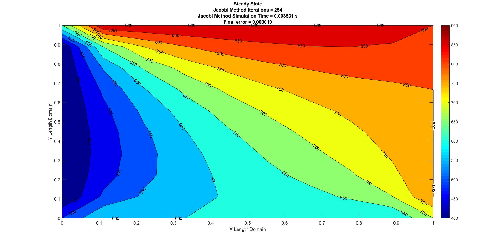
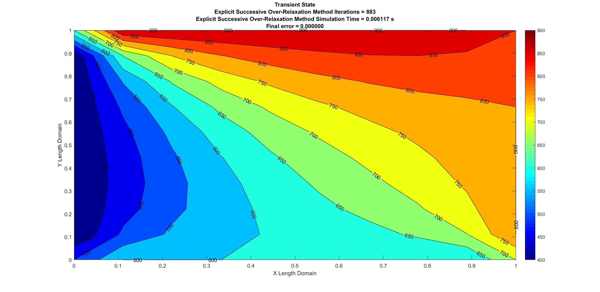

# 2D Heat Conduction

## Steady and Unsteady Analyses

Steady and Unsteady Analyses are an integral part of solving and understanding fluid flow and its properties. For this problem, we will be computing these analyses for the **2 Dimensional Heat Conduction** problem.

Heat transfer is the transfer of thermal energy from a body, at a high temperature, to another at a lower temperature. This transfer of thermal energy may occur under **steady** or **unsteady** state conditions. 

In reality, there is no true 2-Dimensional heat conduction, only 3-Dimensional Heat Conduction. The 2-D Heat Conduction analysis is generally done to observe the flow and its properties in 2-D.

## 2-D Heat Conduction Equation:

The 2-D Heat Conduction Equation is given below:

$$
\frac{\partial T}{\partial t} = \alpha \left( \frac{\partial^2 T}{\partial x^2} + \frac{\partial^2 T}{\partial y^2} \right)
$$

where:
- $(T)$ is the temperature,
- $(\alpha)$ is the thermal diffusivity,
- $(t)$ is time, 
- $(x)$ and $(y)$ are spatial dimensions.

## Derivations for Steady and Transient States

## Steady State:

A fluid state in which there is no change in the fluid property with respect to time is known as a **Steady State**. In the current case, the fluid property in question is temperature. So,

$$
\frac{\partial T}{\partial t} = 0
$$

When the above equation is applied to the main Heat Conduction equation, we have:

$$
\frac{\partial^2 T}{\partial x^2} + \frac{\partial^2 T}{\partial y^2} = 0
$$

assuming that the thermal conductivity $(\alpha)$ is constant.

### Solvers for Steady State:

We solve the steady-state heat conduction equation using three different iterative solvers:

1. **Jacobi Method**
2. **Gauss-Seidel Method**
3. **Successive Over-Relaxation Method**

### Discretization:

Upon discretizing the above steady-state equation using Central Differencing Scheme (CDS), we obtain:

$$
\frac{T_L - 2T_P + T_R}{\Delta x^2} + \frac{T_T - 2T_P + T_B}{\Delta y^2} = 0
$$

where:
- $(T_P = T_{i,j})$
- $(T_L = T_{i-1,j})$
- $(T_R = T_{i+1,j})$
- $(T_T = T_{i,j+1})$
- $(T_B = T_{i,j-1})$

After simplifying, we obtain:

$$
\frac{2T_P}{\Delta x^2} + \frac{2T_P}{\Delta y^2} = \frac{T_L + T_R}{\Delta x^2} + \frac{T_T + T_B}{\Delta y^2}
$$

Assuming $( k = 2 \left( \frac{1}{\Delta x^2} + \frac{1}{\Delta y^2} \right))$, we have:

$$
kT_P = \frac{T_L + T_R}{\Delta x^2} + \frac{T_T + T_B}{\Delta y^2}
$$

So,

$$
T_P = \frac{1}{k} \left[ \frac{T_L + T_R}{\Delta x^2} + \frac{T_T + T_B}{\Delta y^2} \right]
$$

### Jacobi Method:

Representing the above equation in an iterative form:

$$
T_P^{n+1} = \frac{1}{k} \left[ \frac{T_L + T_R}{\Delta x^2} + \frac{T_T + T_B}{\Delta y^2} \right]^n
$$

### Gauss-Seidel Method:

In the Gauss-Seidel method, we use previously calculated values for the next iteration:

$$
T_P^{n+1} = \frac{1}{k} \left[ \frac{T_L + T_R}{\Delta x^2} + \frac{T_T + T_B}{\Delta y^2} \right]^{n+1}
$$

### Successive Over-Relaxation (SOR) Method:

The SOR method is a variant of the Gauss-Seidel method. It is represented as:

$$
T_P^{n+1} = T_P^n (1 - \lambda) + \lambda \left[ \frac{T_L + T_R}{\Delta x^2} + \frac{T_T + T_B}{\Delta y^2} \right]^{n+1}
$$

where $(\lambda)$ is the over-relaxation factor.

---

## Transient State:

A fluid state in which there is a change in the fluid property with respect to time is known as an **Unsteady** or a **Transient State**. Transient conditions are a precursor to steady-state conditions.

The general representation of the Transient 2-D Heat conduction is:

$$
\frac{\partial T}{\partial t} - \alpha \left( \frac{\partial^2 T}{\partial x^2} + \frac{\partial^2 T}{\partial y^2} \right) = 0
$$

### Discretization:

Upon discretizing the above equation using Forward Differencing Scheme (FDS) for time derivative and Central Differencing Scheme (CDS) for spatial derivatives, we obtain:

$$
\frac{T_P^{n+1} - T_P^n}{\Delta t} - \alpha \left( \frac{T_L - 2T_P + T_R}{\Delta x^2} + \frac{T_T - 2T_P + T_B}{\Delta y^2} \right) = 0
$$

Simplifying:

$$
T_P^{n+1} = T_P^n + \Delta t \cdot \alpha \left( \frac{T_L - 2T_P + T_R}{\Delta x^2} + \frac{T_T - 2T_P + T_B}{\Delta y^2} \right)
$$

Assume \( k_1 = \frac{\alpha \Delta t}{\Delta x^2} \) and \( k_2 = \frac{\alpha \Delta t}{\Delta y^2} \). We get:

$$
T_P^{n+1} = T_P^n + k_1 (T_L + 2T_P + T_R) + k_2 (T_T + 2T_P + T_B)
$$

---

### Implicit Form:

In the implicit form, the transient equation is represented as:

$$
T_P^{n+1} = T_P^n + k_1 (T_L^{n+1} + T_R^{n+1}) + k_2 (T_T^{n+1} + T_B^{n+1})
$$

The implicit form of the **Jacobi method** for the transient heat conduction equation is:

$$
T_P^{n+1} = T_P^n + \frac{k_1 (T_L^n + T_R^n) + k_2 (T_T^n + T_B^n)}{1 + 2k_1 + 2k_2}
$$

The **Gauss-Seidel method**:

$$
T_P^{n+1} = T_P^n + \frac{k_1 (T_L^{n+1} + T_R^n) + k_2 (T_T^n + T_B^{n+1})}{1 + 2k_1 + 2k_2}
$$

The **Successive Over-Relaxation method (SOR)**:

$$
T_P^{n+1} = T_P^n (1 - \lambda) + \lambda \left[ T_P^n + \frac{k_1 (T_L^{n+1} + T_R^n) + k_2 (T_T^n + T_B^{n+1})}{1 + 2k_1 + 2k_2} \right]
$$

---

### Explicit Form:

In the explicit form, the equation is simplified to:

$$
T_P^{n+1} = T_P^n (1 - 2k_1 - 2k_2) + k_1 (T_L^n + T_R^n) + k_2 (T_B^n + T_T^n)
$$

The **Explicit form of the Jacobi method**:

$$
T_P^{n+1} = T_P^n (1 - 2k_1 - 2k_2) + k_1 (T_L^n + T_R^n) + k_2 (T_B^n + T_T^n)
$$

The **Gauss-Seidel method**:

$$
T_P^{n+1} = T_P^n (1 - 2k_1 - 2k_2) + k_1 (T_L^{n+1} + T_R^n) + k_2 (T_B^{n+1} + T_T^n)
$$

The **Successive Over-Relaxation method (SOR)**:

$$
T_P^{n+1} = T_P^n (1 - \lambda) + \lambda \left[ T_P^n (1 - 2k_1 - 2k_2) + k_1 (T_L^{n+1} + T_R^n) + k_2 (T_B^{n+1} + T_T^n) \right]
$$

## Results
<!--
### Steady State Analysis

  

<b>Figure 1:</b> Steady State Jacobian

  

<b>Figure 2:</b> Steady State Gauss-Seidel

  

<b>Figure 3:</b> Steady State Successive Over Relaxation

The Successive Over Relaxation method is the most efficient as it has lower simulation time and number of iterations when compared to the Jacobi and Gauss-Seidel methods. It is also very important to understand that to obtain the most optimum or an efficient result in the SOR method, the over relaxation factor $(\lambda)$, should be tweaked i.e according to the given problem parameters, the over relaxation factor should be experimented to obtain an efficient solution. For the above state analysis, the most efficient $(\lambda)$ value is 1.5.

### Transient State Analysis
#### Implicit Schemes

  

<b>Figure 4:</b> Transient Implicit Jacobian

  

<b>Figure 5:</b> Transient Implicit Gauss-Seidel

  

<b>Figure 6:</b> Transient Implicit Successive Over Relaxation

#### Explicit Schemes

  

<b>Figure 7:</b> Transient Explicit Jacobian

  

<b>Figure 8:</b> Transient Explicit Gauss-Seidel

  

<b>Figure 9:</b> Transient Explicit Successive Over Relaxation
 -->

**Steady State:**

| Method                      | Simulation Time (s) | Number of Iterations | Final Error  |
|-----------------------------|---------------------|----------------------|--------------|
| Jacobi                      | 0.003531            | 254                  | 0.000010     |
| Gauss-Seidel                | 0.002519            | 135                  | 0.000009     |
| Successive Over-Relaxation   | 0.002315            | 35                   | 0.000009     |

**Transient State (Implicit Approach):**

| Method                      | Simulation Time (s) | Number of Iterations | Final Error  |
|-----------------------------|---------------------|----------------------|--------------|
| Jacobi                      | 0.014842            | 3202                 | 0            |
| Gauss-Seidel                | 0.011276            | 2364                 | 0            |
| Successive Over-Relaxation   | 0.011358            | 2023                 | 0            |

**Transient State (Explicit Approach):**

| Method                      | Simulation Time (s) | Number of Iterations | Final Error  |
|-----------------------------|---------------------|----------------------|--------------|
| Jacobi                      | 0.009674            | 1801                 | 0            |
| Gauss-Seidel                | 0.007159            | 1221                 | 0            |
| Successive Over-Relaxation   | 0.006117            | 883                  | 0            |

The above table shows the overall statistics of the methods implemented in the current analysis. We can successfully infer that of all the iterative methods used, the Successive Over-Relaxation method has the best results for the analysis as it has the lowest possible simulation time and iterations. Of all the approaches present, the Explicit Transient state analysis has the best possible solution statistics with respect to the simulation time. The steady state also has the lowest stats, but it is important to understand that the steady state is time independant and does not rely on Thermal Conductivity.

| Method                                    | Simulation Time (s) | Number of Iterations | Final Error  |
|-------------------------------------------|---------------------|----------------------|--------------|
| Successive Over-Relaxation (Steady)       | 0.002315            | 35                   | 0.000009     |
| Explicit Successive Over-Relaxation (Transient) | 0.006117            | 883                  | 0            |

It is very important to understand that the SOR method also depends on a lot of factors like the Over Relaxation Factor, Thermal Conductivity, grid size and the time parameters. Particular to the SOR method, the over relaxation factor gives an edge when compared to the other methods as it can be tweaked easily to find the best possible accurate solution.

